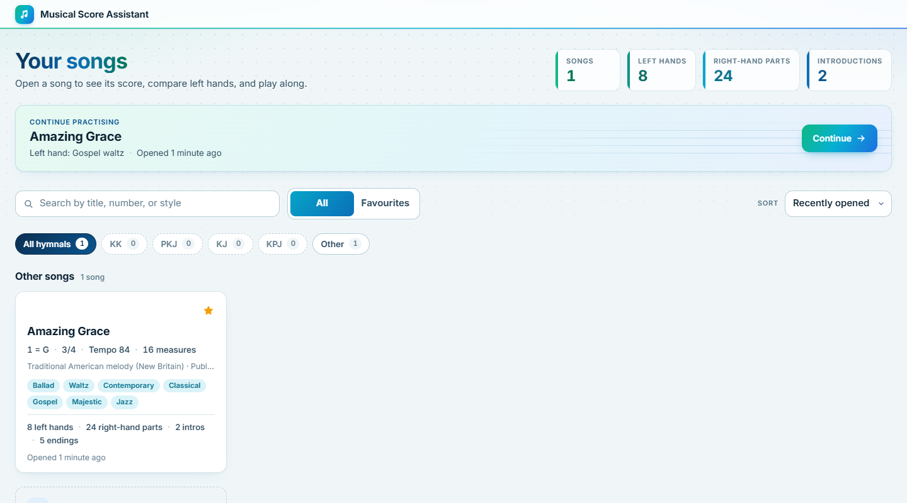
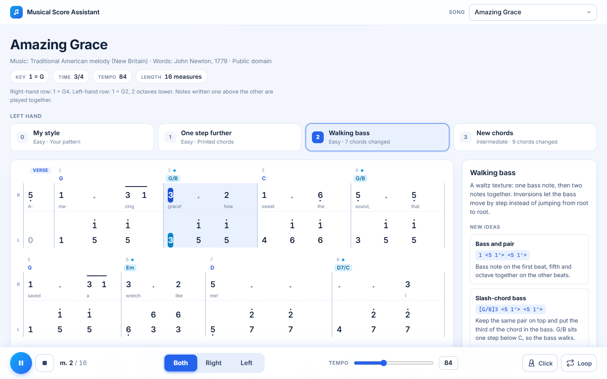
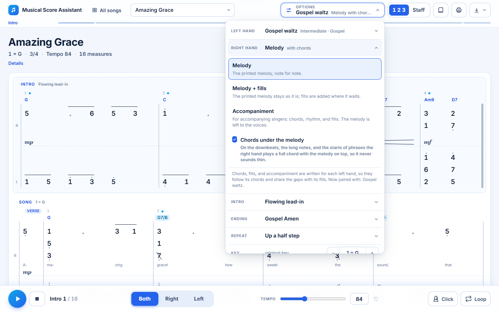
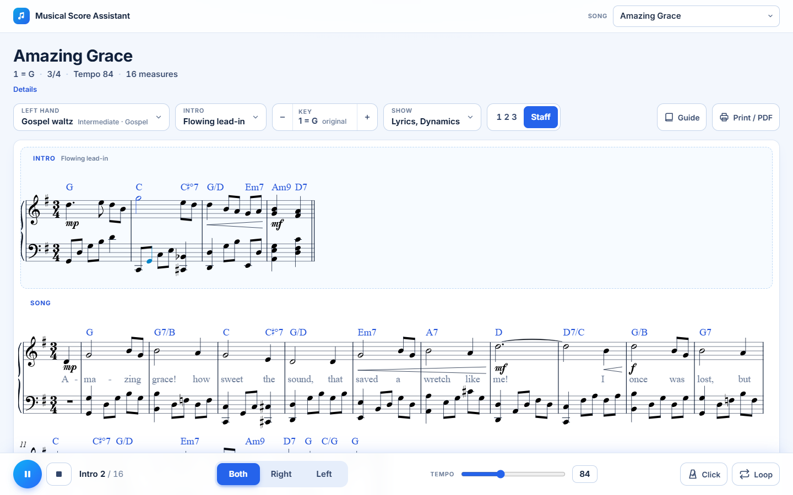
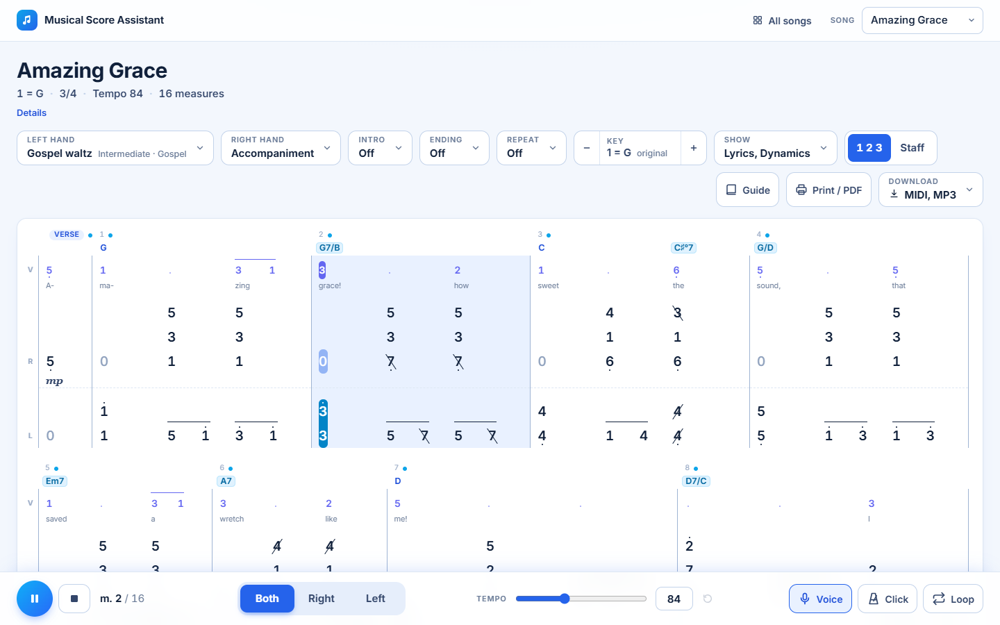
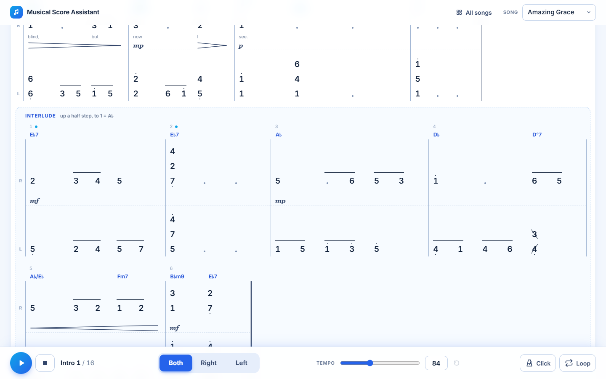
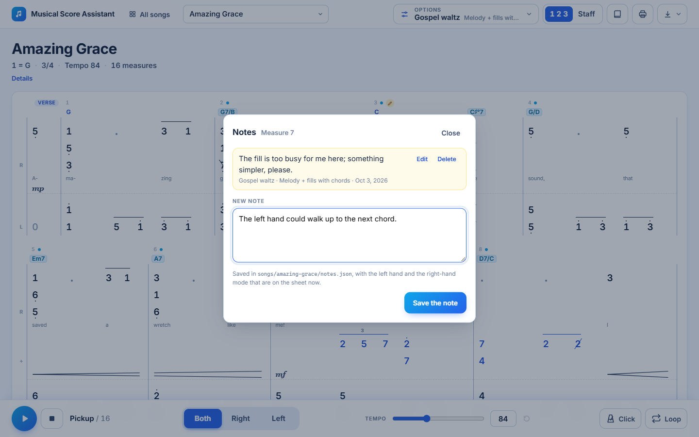

# Musical Score Assistant

A personal practice tool for pianists who read numbered notation (_not angka_). It shows a song as
a two-row numbered score, offers several left-hand arrangements to choose from, and plays them
back so each idea can be heard before it is practised.

It runs at <https://music-assistant.tierratie.com>. Anybody can open the public songs there; the
owner signs in with Google to see the private songs and to keep notes, favourites, and settings
with the account.















## What it does

- **A home page for the library.** Every song has a card with its key, meter, tempo, styles, and
  the number of left hands, right-hand parts, and introductions written for it. The song that
  was practised last can be continued with one click; songs can be searched, sorted, and marked
  as favourites.
- **Songs grouped by hymnal.** A song names the hymnal it comes from (Kidung Keesaan, Pelengkap
  Kidung Jemaat, Kidung Jemaat, Kidung Pasamuwan Jawi) and is cited the way a service sheet
  cites it: "PKJ 184". The home page and the song menu list the songs hymnal by hymnal.
- **Numbered score for both hands.** The melody is on the upper row and the left hand on the
  lower row, aligned beat for beat, with chords above, lyrics below the melody, and dynamics
  between the hands. Notes that are struck together are written one above the other.
- **Left-hand arrangements by level and style.** Every song starts with _My style_, a plain
  root-fifth-octave pattern on the printed chords. Further arrangements are grouped as easy,
  intermediate, and advanced, and each teaches a style: ballad, hymn, classical, gospel,
  majestic, jazz. A guide explains the new patterns and every changed measure.
- **Three roles for the right hand.** _Melody_ plays the printed tune. _Melody + fills_ keeps
  every printed note, long notes held as written, and adds fills on a row of their own where
  the tune waits. _Accompaniment_ leaves the tune to the singers and plays chords, rhythm, and
  fills instead; the sung melody stays on the sheet as a small row and can be played as a soft
  guide.
- **A full right hand.** Where the right hand plays the melody, it gets chord notes under it
  on the downbeats, the long notes, and the starts of phrases, so it does not sound like one
  finger. The chords can be switched off to see the plain tune. Chords, fills, and
  accompaniment are written for each left hand, so they agree with its harmony and share the
  gaps with its fills.
- **An introduction.** An optional intro plays before the song: the last phrase of the song, or
  one of several newly written ones in different styles. It has its own block at the top of the
  sheet.
- **Fills where the melody waits.** Every arrangement fills the long notes and rests of the
  melody with a figure that keeps the beat audible and leads into the next phrase.
- **Numbers or staff.** One switch turns the numbered score into staff notation on a grand
  staff, with the same playhead, chords, lyrics, and dynamics.
- **Transposition.** Move the song up or down by half steps. The digits stay the same; the key,
  the chord symbols, and the sound change.
- **Dynamics.** Marks from _pp_ to _ff_ and crescendo or diminuendo hairpins are shown on the
  sheet and shape the loudness of the playback.
- **Rolled chords.** A chord can be written as rolled: its notes follow each other within a
  few hundredths of a second instead of sounding at once, on the sheet (a wavy line), in the
  playback, and in the MIDI file.
- **A beginning, a repeat, and an ending.** An introduction leads into the song over a bridge
  that cues the singers. The song can be repeated a half step or a whole step higher (a
  modulation): an interlude lifts the key, and the score continues below with the repeat. A
  choice of written endings, from a plain _Amen_ to a gospel walk-up, closes the piece.
- **Playback that follows the page.** Play both hands, the right hand alone to check the melody,
  or the left hand alone to hear a suggestion, with or without the voice guide. The note being
  played is highlighted on the score. A hand that is switched off stays on the sheet, drawn
  pale, with a pale playhead of its own, so the eye can still follow what the other hand
  would play.
- **Practice controls.** A tempo that can be dragged or typed, a metronome with a count-in,
  looping a range of measures, and switching arrangements, keys, or hands while the music keeps
  playing. The menu of a measure locks the playback to that measure and repeats it. Between
  two rounds the loop rests for a few beats and counts them on the sheet, so there is time to
  breathe and to find the start again.
- **Notes on measures.** The same menu takes a note on a measure: a correction, something to
  change, something that works. Notes are saved together with the arrangement that was on the
  sheet, so they are at hand when the song is revised.
- **One account on every device.** On the public site the owner signs in with Google. Private
  songs (copyrighted ones, kept out of the repository) appear only then, and notes,
  favourites, recent songs, and settings follow the account from the laptop to the phone.
  Guests see the public songs, and what they mark stays in their browser.
- **Controls that stay out of the way.** Everything that decides what is on the sheet sits
  behind one **Options** button in the top bar: a short list of settings with their current
  values, each of which opens to show its choices.
- **Always know where you are.** A thin progress bar under the controls names the part of the
  piece that is in view or being played (_Intro_, _Song (verse)_, _Song (refrain)_,
  _Interlude_, _Ending_) and fills up to the right as the piece goes on. A click on a part of
  the bar leads there.
- **Made for the phone on the music stand.** In a narrow window the controls stay in reach in
  one row at the top, menus open as sheets from the bottom edge, and the playback bar shrinks
  to two short rows, so most of the screen is left for the score. The library shows the songs
  without totals and counts, with the filter and the sorting a full row each.
- **A score as large as you want it.** A phone held upright fits about two measures per line
  and a phone held sideways four; a tablet or a computer fits as many as its width allows. `−`
  and `+` at the right of the progress bar make the score smaller or larger on any screen (50
  to 180 percent), and a click on the percentage returns to the fitted size. Each device keeps
  its own size.
- **An app on the phone and the tablet.** Installed from the browser, the app opens from the
  home screen in a window of its own, without the bars of the browser, and works without a
  connection: the songs, the private ones included once the owner has signed in, the notes, and
  the piano sound. On a song the screen stays on, and a button beside the zoom gives the whole
  screen to the score. See [Installing the app](#installing-the-app).
- **Print or save as PDF.** The sheet is laid out for A4 paper with the current arrangement,
  key, and introduction. It prints in black with the browser's default settings; "Background
  graphics" does not have to be switched on.
- **MIDI and MP3 download.** The same performance as a file: introduction, both hands as
  chosen, key, repeat, ending, and dynamics as on the sheet, at the tempo of the slider. MIDI
  holds the notes, one track per hand and one for the voice guide; MP3 is a recording with the
  sounds of the app. The menu shows how large each file will be, and before a file is made a
  dialog lists everything it will hold (left hand, right hand, intro, repeat, ending, key,
  tempo, hands, length, file name, size), so nothing is downloaded with the wrong settings.

The web app only displays and plays. Songs and arrangements are plain files in `songs/`, written
outside the app (see [Adding a song](#adding-a-song)). A small server, part of this repository,
signs the owner in and keeps what belongs to the account.

## Requirements

- Node.js 22 or newer
- npm 10 or newer

## Getting started

```bash
npm install
npm run dev
```

Open the address that Vite prints (by default <http://localhost:5173>). `npm install` also points
git at the versioned hooks in `.githooks/`.

On this computer nobody signs in: the development server treats it as the owner, with every
song, private ones included. Putting the app on the server is described in
[docs/deployment.md](docs/deployment.md).

## Using the app

The app opens on the home page. **Continue** reopens the song that was practised last with the
left hand that was selected; a click on a card opens that song. The songs are listed hymnal by
hymnal; the row of buttons above them (**All hymnals**, **KK**, **PKJ**, **KJ**, **KPJ**) narrows
the list to one hymnal and shows how many songs each has. The star marks a favourite, and the
search box looks at titles, hymnals, numbers ("pkj 184"), credits, and styles. On a song page,
the name of the app in the top bar leads back, as do **All songs** beside it on a computer and
the Back button of the browser. Every song has an address of its own (`#song=amazing-grace`), so it can be bookmarked.

On a song page, the top bar decides what is shown; the bar at the bottom controls playback.
Under the controls runs the progress bar. It is divided into the parts of the piece, each as
wide as its share of the measures: the introduction, the sections of the song as its file
names them (verse, refrain), the interlude and the repeat when **Repeat** is on, and the
ending. The name on the left is the part you are in. While the music plays, the bar follows
the playhead; otherwise it follows the page as it scrolls, and it is full when the end of the
piece is reached. A click on a part scrolls there and moves the playhead to its first measure.

**Options** opens the settings of the score as a list. Each line shows the choice in effect,
and a click on a line opens its choices; the list stays open, so several settings can be
changed in one go. The line of the setting that is open stays at the top of the panel while its
choices scroll, so it is always clear which setting they belong to.

| In **Options** | What it does                                                                                      |
| -------------- | ------------------------------------------------------------------------------------------------- |
| **Left hand**  | The arrangements, grouped by level, each tagged with its style                                    |
| **Right hand** | Melody, _Melody + fills_, or _Accompaniment_, and whether the melody gets chords under it         |
| **Intro**      | Off, _Last phrase_ (followed by a bridge into the song), or a written intro                       |
| **Ending**     | Off, or one of the written endings; it follows the last measure of the song                       |
| **Repeat**     | Off, or the song a second time a half or whole step higher, after an interlude that lifts the key |
| **Key**        | Transposes by half steps; click the key to return to the original                                 |
| **Show**       | Shows or hides lyrics and dynamics                                                                |

| Beside it         | What it does                                                                                                                  |
| ----------------- | ----------------------------------------------------------------------------------------------------------------------------- |
| **1 2 3 / Staff** | Switches between numbered notation and staff notation                                                                         |
| **Guide**         | Opens the panel that explains the arrangement: patterns, tips, what changed per measure, and your own notes                   |
| **Print / PDF**   | Opens the print dialog; choose "Save as PDF" as the destination for a file                                                    |
| **Download**      | Shows MIDI (`.mid`) and MP3 with their sizes; a choice opens a summary of the settings, and **Download** in it saves the file |

| Playback action           | Mouse                                         | Keyboard                                                                 |
| ------------------------- | --------------------------------------------- | ------------------------------------------------------------------------ |
| Play or pause             | Round button                                  | `Space`                                                                  |
| Stop and return to start  | Square button                                 | `Home`                                                                   |
| Both hands / left / right | Segmented control                             | `1` `2` `3`                                                              |
| Voice guide on or off     | **Voice** button                              | `V`                                                                      |
| Move the playhead         | Click a measure                               | `Enter` on a focused measure                                             |
| Set the tempo             | Drag the slider, or click the number and type | `Enter` applies, `Esc` cancels, `↑` `↓` step by one, with `Shift` by ten |
| Back to the printed tempo | Arrow button beside the number                |                                                                          |
| Score smaller or larger   | `−` and `+` beside the progress bar           | `-` and `+`; `0` returns to the fitted size                              |

The tempo ranges from 40 to 160 beats per minute; a typed number outside that range is brought
to the nearest limit.

**Every measure has a menu.** Click a measure: besides moving the playhead there, the click
puts a button with three dots at the top right corner of the measure, and that button opens
the menu. A right click on a measure, or a long press on a phone, opens the same menu
directly. `Esc` or a click beside the measures takes the button away again.

| In the menu of a measure    | What it does                                                                          |
| --------------------------- | ------------------------------------------------------------------------------------- |
| **Play from here**          | Moves the playhead to the measure and starts playing                                  |
| **Loop this measure**       | Locks the playback to this one measure and repeats it, with a rest between the rounds |
| **Extend the loop to here** | Widens a loop that is on, so it runs from its first measure to this one               |
| **Switch the loop off**     | Plays straight through again                                                          |
| **Write a note…**           | Opens the notes on this measure: write one, change one, delete one                    |

**A loop takes a breath.** After each round of a loop, nothing plays for a short rest before
the next round begins: two beats in a meter counted in twos or fours, three beats in a meter
counted in threes (three-four, six-eight). The beats are counted in large grey numbers in the
middle of the measure where the loop starts again, and the metronome, when it is on, keeps
clicking through the rest. The measures of a loop are tinted, and the last of them carries a
**Loop ✕** button at its top right corner: a click switches the loop off, and the music plays
straight on. The **Loop** button in the playback bar does the same.

**Notes stay with the song.** A note is free text: a wrong pitch, a fill that is too busy, a
chord worth keeping. It is stored with what was on the sheet when it was written (left hand,
right-hand mode, introduction, ending, key). A measure with a note carries a small pencil next
to its number, which opens the notes again, and the guide lists all notes of the song under
**Your notes**. A note on a measure of the song also shows in the repeat; a note on an
introduction or an ending belongs to that introduction or ending.

Where notes are kept depends on who writes them. The owner's notes on the public site are kept
in the R2 bucket with the account; `npm run notes:pull` copies them into
`songs/<song>/notes.json` on this computer, a git-ignored file that is read whenever the song is
worked on again. With `npm run dev` notes go straight into that file. A guest's notes stay in
the browser, and move to the account the next time its owner signs in on that browser.

A dot next to a measure number means the guide explains that measure. Chords on a light-blue
background differ from the printed score. The **Voice** button appears while the right hand
accompanies; the row marked V is what the singers sing. The intro, the right-hand mode, the
visible rows, the favourites, and the left hand last used for each song are remembered between
visits: with the account when the owner is signed in, otherwise in this browser.

## Installing the app

The public site can be installed as an app; nothing comes from an app store.

| Device                                    | How to install                                                              |
| ----------------------------------------- | --------------------------------------------------------------------------- |
| Android phone or tablet (Chrome, Samsung) | **Install** on the card of the home page, or the browser menu → Install app |
| iPhone or iPad (Safari)                   | Share → **Add to Home Screen**; the card on the home page says the same     |
| Computer (Chrome, Edge)                   | **Install** on the card, or the install icon in the address bar             |

The card can be put away with its cross; the browser menu still installs the app afterwards.

What the installed app does differently:

- It opens in a window of its own, with the whole height of the screen for the score.
- It works without a connection. The app and the piano sound are fetched when it is installed;
  the staff notation the first time it is shown; the private songs and the notes whenever the
  owner opens them while connected. Without a connection the app uses what it has kept, and
  when the network answers again it takes the newest version, so a deploy reaches the app on
  its next start. Signing out removes what was kept of the account.
- On a song page the screen does not dim or lock while the page is in front.
- **Full screen** (the button with four corners, beside the zoom) hides the status bar of the
  phone or tablet as well; press it again, or swipe from the edge, to leave. Safari on an
  iPhone has no full screen for pages, so the button is missing there.

## Adding a song

1. Create a folder under `songs/` (or under `songs/private/` for copyrighted material), named
   after the hymnal, the number, and the title: `pkj-184-nama-yesus-termulia`.
2. Write `song.txt`: header, melody, chords, lyrics, dynamics. `book: PKJ` and `number: 184` in
   the header put the song under its hymnal.
3. Read the song before arranging it, and write the reading down as `analysis.md`: what the
   text says, the mood to build, where the climax is, and what follows for the arrangements.
4. Optionally write `arrangements.json` with left-hand arrangements, the right-hand parts
   that go with them, introductions, a bridge, a key lift, and endings.
5. Run `npm run check` and fix what it reports.

Arrangements are written for a 61-key keyboard (C2 to C7), so the left hand never goes below C2.

The formats are described in [docs/song-format.md](docs/song-format.md). With the development
server running, the app reloads as soon as a file changes.

`songs/private/` is git-ignored. Keep copyrighted songs and scans of printed scores there so they
stay out of the public repository. The built site contains only the songs outside
`songs/private/`, and a deploy refuses a build that contains one. `npm run songs:push` sends the
private songs to the R2 bucket, from which the server hands them to the signed-in owner only;
they appear on the site at once, without a deploy. Scans never leave this computer.

A push to `main` deploys: GitHub Actions checks the project and puts the new version on the
server ([docs/deployment.md](docs/deployment.md)).

## Commands

| Command              | Purpose                                                                      |
| -------------------- | ---------------------------------------------------------------------------- |
| `npm run dev`        | Start the development server                                                 |
| `npm run build`      | Type-check, build the site into `dist/` and the server into `dist-server/`   |
| `npm run preview`    | Serve the built site locally                                                 |
| `npm start`          | Run the built server (see [docs/deployment.md](docs/deployment.md))          |
| `npm run deploy`     | Build and put the app on the server (GitHub Actions does this on every push) |
| `npm run songs:push` | Send the private songs to the R2 bucket; `-- --dry-run` only lists changes   |
| `npm run notes:pull` | Copy the owner's notes from the R2 bucket into the song folders              |
| `npm run check`      | Check every song under `songs/`; add `-- --dump` for details                 |
| `npm test`           | Run the unit tests                                                           |
| `npm run lint`       | Lint the source with ESLint                                                  |
| `npm run typecheck`  | Type-check the project and the service worker                                |
| `npm run format`     | Format the source with Prettier                                              |
| `npm run verify`     | Lint, type-check, test, check songs, and build                               |

## Project structure

```
songs/              song folders (song.txt, analysis.md, arrangements.json, and notes.json for your notes)
src/core/           music engine: parsing, chords, arrangements, validation (no browser code)
src/audio/          playback engine built on Tone.js
src/store/          player state, display settings, and what was opened
src/ui/             React components: home page, song page, score, and controls
src/service-worker/ the service worker of the installed app: what it keeps and when
server/             the server: Google sign-in, private songs, notes, account state
scripts/            command-line tools, deploy, and the API inside the development server
deploy/             the Docker Compose file and the receive script of the server
tests/              unit tests
docs/               format reference, architecture, deployment, roadmap
public/             the manifest and icons of the installed app, and the piano samples
```

More detail is in [docs/architecture.md](docs/architecture.md). Planned work is listed in
[docs/roadmap.md](docs/roadmap.md).

## Contributing

Repository rules live in [CLAUDE.md](CLAUDE.md). In short: commits follow Conventional Commits,
are written in English, and must not carry AI attribution; a `commit-msg` hook enforces the last
point. Run `npm run verify` before committing.

## Credits

- Piano sound: [Salamander Grand Piano V3](https://sfzinstruments.github.io/pianos/salamander/) by
  Alexander Holm, licensed under
  [CC BY 3.0](https://creativecommons.org/licenses/by/3.0/). See
  [public/samples/piano/README.md](public/samples/piano/README.md).
- Audio scheduling: [Tone.js](https://tonejs.github.io/).
- Staff-notation engraving: [Verovio](https://www.verovio.org/) (LGPL-3.0).
- MP3 encoding: [lamejs](https://github.com/gideonstele/lamejs) (LGPL-3.0).
- Demo song: "Amazing Grace" (John Newton, 1779; tune "New Britain"), public domain.
